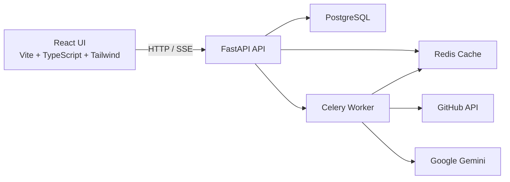
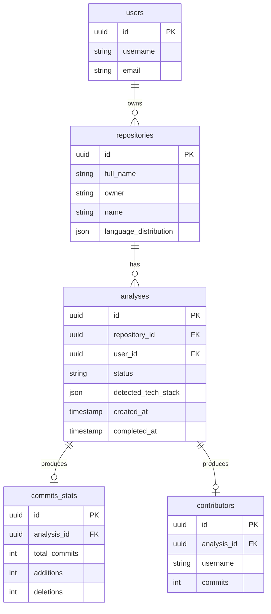

# 🔍 GitHub Repository Analyzer

> **Turn any public GitHub repo into a data-rich insight dashboard.**

[](https://fastapi.tiangolo.com/)
[](https://react.dev/)
[](https://www.typescriptlang.org/)
[](https://docs.celeryq.dev/)
[](https://www.docker.com/)
[](LICENSE)

A production-ready, full-stack analyzer for GitHub repositories. It fetches commits, contributors, and language data, runs background analysis with Celery, caches aggressively with Redis, persists results in PostgreSQL, and surfaces everything through a clean React dashboard — optionally enriched with AI insights from Google Gemini.

## What It Does

Paste any public repo URL. Within seconds, you get:

| Feature | Description |
|--------|-------------|
| **Code Metrics** | Total commits, commit frequency, churn, average commit size, time between commits |
| **Contributor Analytics** | Top contributors, bus factor risk score, commit distribution |
| **Language Breakdown** | Visual pie chart of repository languages by bytes |
| **AI Insights** | Project summary, README quality score, tech stack detection, architecture analysis |
| **Async & Cached** | Redis-backed caching for GitHub data, async database calls, background job processing |

## Architecture



### Clean Architecture Layers

```
┌─────────────────────────────────────┐
│  API Layer (FastAPI, schemas, DI)   │
├─────────────────────────────────────┤
│  Use Cases (orchestration)          │
├─────────────────────────────────────┤
│  Domain (entities, pure logic)      │
├─────────────────────────────────────┤
│  Infrastructure (DB, Redis, HTTP)   │
└─────────────────────────────────────┘
```

| Layer | Directory | Responsibility |
|---|---|---|
| **Domain** | `backend/app/domain/` | Entities, repository interfaces, pure business logic |
| **Use Cases** | `backend/app/usecases/` | Application orchestration with zero framework dependencies |
| **Infrastructure** | `backend/app/infrastructure/` | Database, Redis, GitHub client, Celery tasks |
| **API** | `backend/app/api/` | FastAPI routes, Pydantic schemas, middleware |

> **Dependency rule:** outer layers depend inward. The domain layer depends on nothing.

## Quick Start

### Prerequisites

- [Docker](https://docs.docker.com/get-docker/) & [Docker Compose](https://docs.docker.com/compose/)
- (Optional) [GitHub Personal Access Token](https://github.com/settings/tokens) — higher rate limits
- (Optional) [Google Gemini API Key](https://ai.google.dev/) — enables AI insights

### 1. Clone & Configure

```bash
git clone <repo-url>
cd github_repo_analyzer/backend
cp .env.example .env
# Edit .env and add GITHUB_TOKEN and/or GEMINI_API_KEY
```

### 2. Run Everything

```bash
cd ..
docker compose up --build
```

Services will be available at:

| Service | URL |
|---|---|
| Frontend | http://localhost:3000 |
| API | http://localhost:8000 |
| Swagger UI | http://localhost:8000/docs |
| PostgreSQL | localhost:5432 |
| Redis | localhost:6379 |

### 3. Analyze a Repository

```bash
curl -X POST http://localhost:8000/api/v1/analyses/analyze \
  -H "Content-Type: application/json" \
  -d '{"owner": "fastapi", "name": "fastapi"}'
```

Response:

```json
{
  "analysis_id": "a1b2c3d4...",
  "repository_id": "e5f6g7h8...",
  "status": "pending",
  "message": "Analysis queued. Poll GET /analyses/{analysis_id} for results."
}
```

Then poll for results:

```bash
curl http://localhost:8000/api/v1/analyses/{analysis_id}
```

Or just use the web UI — it's prettier. 🎨

## Project Structure

```
github_repo_analyzer/
├── backend/
│   ├── app/
│   │   ├── api/                     # FastAPI layer
│   │   │   ├── routes/
│   │   │   │   ├── analysis.py      # POST /analyze, GET /analyses/{id}
│   │   │   │   └── health.py        # GET /health
│   │   │   ├── schemas.py           # Pydantic request/response models
│   │   │   ├── dependencies.py      # DI composition root
│   │   │   └── rate_limit.py        # slowapi rate limiter
│   │   ├── core/                    # Config, logging, exceptions
│   │   ├── domain/                  # Pure business logic
│   │   ├── infrastructure/          # External concerns
│   │   │   ├── cache/               # Redis cache + CachedGitHubClient
│   │   │   ├── database/            # SQLAlchemy models, async session, repos
│   │   │   ├── external/            # GitHub & Gemini API clients
│   │   │   └── jobs/                # Celery app & background tasks
│   │   ├── usecases/                # Application services
│   │   └── main.py                  # FastAPI app factory
│   ├── alembic/                     # Database migrations
│   ├── tests/
│   │   ├── unit/                    # Fast pure-logic tests
│   │   └── integration/             # API tests (requires DB)
│   ├── Dockerfile
│   └── pyproject.toml
├── frontend/
│   ├── src/
│   │   ├── api/client.ts            # Axios client with types
│   │   ├── components/              # Charts, metrics, AI panel
│   │   └── pages/                   # Home & analysis views
│   ├── Dockerfile
│   └── package.json
├── docker-compose.yml
└── README.md
```

## Database Schema



Design highlights:

- **UUIDs everywhere** — safe for distributed Celery worker ID generation
- **CASCADE deletes** from repository → analyses → stats
- **Indexes** on foreign keys, status, and `full_name`
- **JSON columns** for `language_distribution` and `detected_tech_stack`

## API Endpoints

| Method | Path | Description |
|---|---|---|
| `POST` | `/api/v1/analyses/analyze` | Trigger analysis (returns `202 Accepted`) |
| `GET` | `/api/v1/analyses/{id}` | Get analysis detail |
| `GET` | `/api/v1/analyses/` | List analyses with optional `repository_id` filter |
| `GET` | `/api/v1/health` | Health check |

## Configuration

All settings are driven by environment variables. Copy `backend/.env.example` to `backend/.env` and adjust:

| Variable | Description | Default |
|---|---|---|
| `GITHUB_TOKEN` | GitHub PAT for higher rate limits | *(empty)* |
| `GEMINI_API_KEY` | Google Gemini API key | *(empty)* |
| `POSTGRES_*` | Database connection params | localhost:5432 |
| `REDIS_URL` | Redis cache connection | `redis://localhost:6379/0` |
| `RATE_LIMIT_PER_MINUTE` | API rate limit per IP | `30` |

## Running Tests

```bash
cd backend

# Unit tests — no external dependencies
pytest tests/unit -v

# Full suite — needs Postgres + Redis
pytest tests/ -v --cov=app
```

## 🧠 Key Architectural Decisions

1. **Clean Architecture** — domain logic is isolated from frameworks. Swap FastAPI for Flask or SQLAlchemy for another ORM without touching business rules.

2. **Celery for Background Jobs** — GitHub pagination + Gemini calls take 30–120s. Celery with `acks_late=True` ensures work survives worker crashes.

3. **Redis Multi-Role** — shared Redis instance with separate logical databases for cache, Celery broker, and result backend.

4. **CachedGitHubClient (Proxy Pattern)** — transparently wraps the raw GitHub client. Immutable data is cached for 24h; mutable metadata for 1h.

5. **Bus Factor Algorithm** — sorts contributors by commits, accumulates until ≥80% threshold. A bus factor of 1 is a red flag. 

6. **Async Everything** — `asyncpg` + `httpx` + `redis.asyncio` keep the FastAPI event loop free. Celery tasks bridge to async code with `asyncio.run()`.

7. **Rate Limiting** — `slowapi` with Redis backend, per-IP sliding window. The `/analyze` endpoint has a tighter 10/min limit.


## Contributing

Contributions are welcome! Please open an issue first to discuss what you'd like to change, or submit a pull request with a clear description.

## License

This project is licensed under the MIT License — see [LICENSE](LICENSE) for details.

---

<p align="center">Built with ☕, 🐍, and ⚛️</p>
